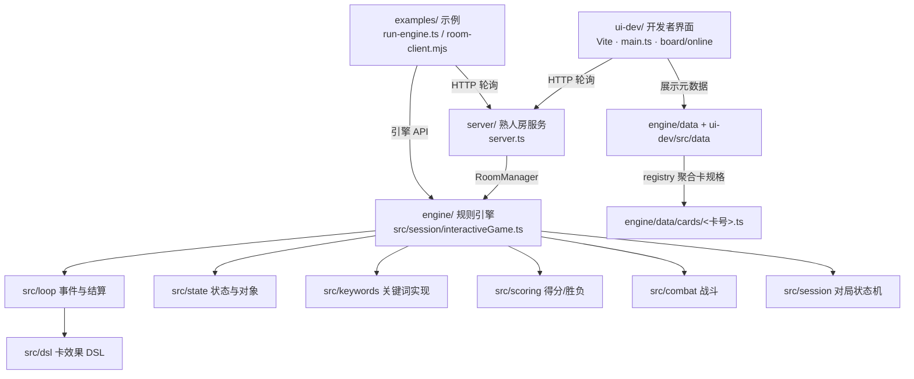

# 架构

本仓库由四个相对独立的部分组成：规则引擎、卡数据、联机服务、开发者界面。它们的分工如下。

## 目录职责

| 目录 | 职责 |
|---|---|
| `engine/src/loop` | 事件类型、结算归约、链与优先权、合法动作、清理 |
| `engine/src/state` | 局面 `GameState`、对象、区域、法力池、战力、移动作业 |
| `engine/src/session` | `InteractiveGame` 对局状态机（`pending`/`legalActions`/`apply`/`view`） |
| `engine/src/combat` | 战斗结算、伤害分配、战斗角色 |
| `engine/src/keywords` | 各关键词实现（`standby`、`deflect`、`lastRites` 等，25 个源文件） |
| `engine/src/effects` | 被动/替换/持续效果、卡牌被动、时机 |
| `engine/src/dsl` | 卡效果描述层：`Card`、`Trigger`、`selector`、`primitives` |
| `engine/src/game` | 建局 `setup`、经济/费用、调度、牌表导入与合法性 |
| `engine/src/scoring` | 得分、据守/征服、燃尽、替代胜利条件 |
| `engine/src/replay` | 录像记录与存储 |
| `engine/src/net` | 房间 `Room`/`RoomManager`、脱敏投影 `project`、日志 `journal` |
| `engine/data` | 卡数据表（卡名/类别/别名/费用/事实）与 `cards/` 卡实现；`registry.ts` 聚合 |
| `engine/test` | 行为测试（572 个测试文件） |
| `server` | 本地 HTTP 服务：路由 + 文件录像 IO |
| `ui-dev` | 极简对局界面与卡组工具 |
| `examples` | 可运行示例 |

## 入口映射

| 入口 | 位置 | 说明 |
|---|---|---|
| 引擎装配 | `engine/data/gameDeps.ts` (`installProviders` / `makeGameDeps`) | 进程级 provider 与依赖表 |
| 建局 | `engine/src/game/setup.ts` (`setupGame`) | 洗牌、起手、战场 |
| 对局驱动 | `engine/src/session/interactiveGame.ts` (`InteractiveGame`) | `pending` / `legalActions` / `apply` / `view` |
| 卡规格聚合 | `engine/data/registry.ts` | `PLAY_SPECS` / `TRIGGER_FACTORIES` / 费用表 |
| 引擎版本出口 | `engine/src/index.ts` | `ENGINE_VERSION` / `RULESET_VERSION` |
| 服务端 | `server/server.ts` | HTTP 路由，端口 5180 |
| 界面 | `ui-dev/index.html` → `ui-dev/src/main.ts` | Vite，端口 5177 |
| 示例 | `examples/run-engine.ts`、`examples/room-client.mjs` | 引擎驱动 / 联机客户端 |

## 数据流

1. 服务端用 `makeGameDeps` + `setupGame` + `InteractiveGame` 建一局，房间持有权威 `game`。
2. 客户端 `/api/view` 拿到的是 `game.view(viewer)` 经 `project` 脱敏后的 `ClientView`。
3. 客户端 `/api/submit` 提交动作，服务端 `apply` 后更新权威状态。
4. 界面只读 `ClientView` 渲染，不持有引擎状态。

更细的接入顺序见 [ENGINE_INTEGRATION.md](ENGINE_INTEGRATION.md)，端点见 [NETWORK_API.md](NETWORK_API.md)。
